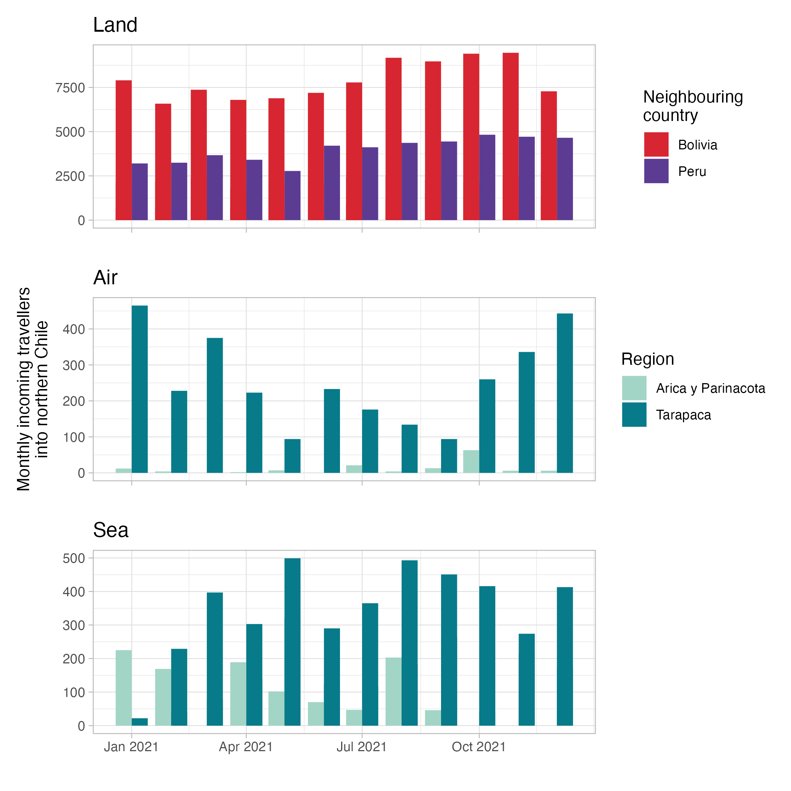
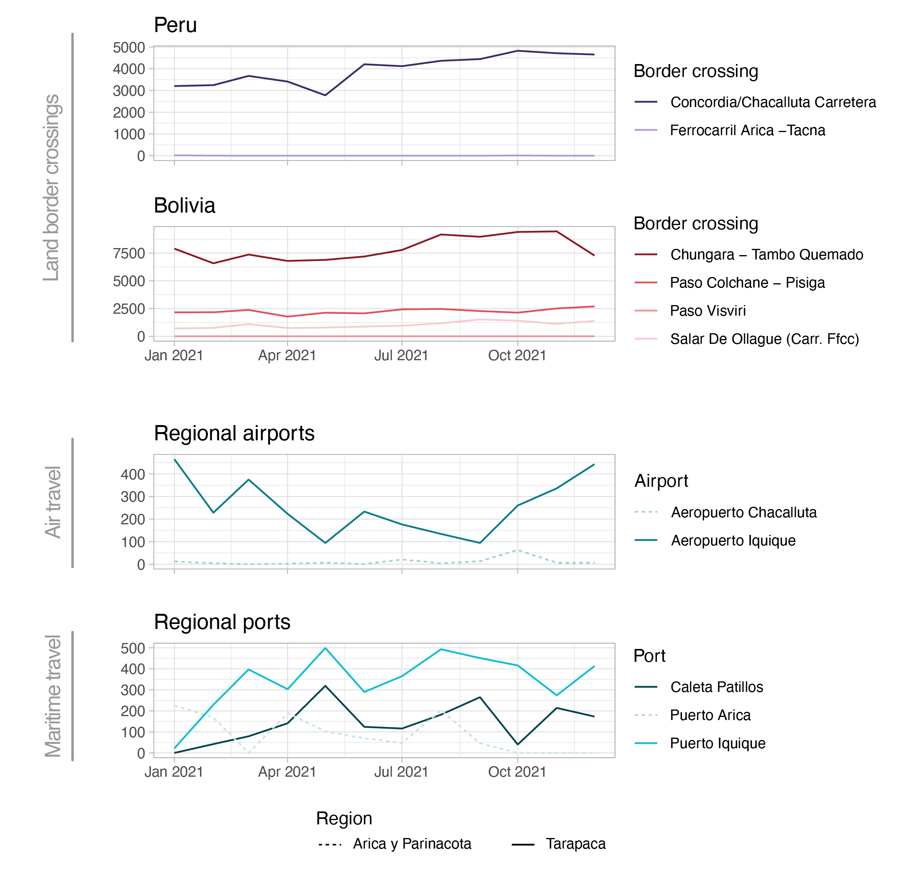

# Likelihood of the establishment of Dengue virus in northern Chile

## Repository structure and general notes
The structure of this repository is shown below.  

This repository contains various data types from South America and Chile specifically. Aggregted monthly estimates of incoming travellers to Chile during 2021, split by ports of entry (land border crossings, maritime ports, airports), can be found under [`data/human_mobility`](data/human_mobility) with the relevant script for their analyses included (all scripts are found on the main directory).

A general phylogeographic analyses has been performed following the pipeline developed by [`Rhys P.D. Inward`](https://github.com/rhysinward) and available [`here`](https://github.com/rhysinward/dengue_pipeline.git). It retrieved complete genomes and E gene sequences from publicly available data bases (namely GenBank), prepares the data and accompanying metadata, and stages a phylodynamic analysis pipeline resulting in time-calibrated Maximum Likelihood phylogenies for each DENV serotype in the Americas.

```
DENV_north_Chile/
├── data
│   ├── human_mobility
│   └── opendengue
├── analyses
├── plots
├── Human_mobility_north_CL.R
└── README.md
```

## Human mobility into Arica and Tarapaca
The two northernmost regions of Chile are Arica (y Parinacota) and Tarapacá, sharing international land borders with Peru and Bolivia. The number of people who entered the country during 2021 was relatively stable over time, with more travellers entering from Bolivia than from Peru. Specific land border crossing points account for the majority of travellers in each case.

Regional airports represent a small portion of incoming travellers (excluding travellers entering the country via other airports and reaching these regions via domestic land travel) with a more evident seasonal trend (Iquique airport in the Tarapaca region is the main contributor); Tarapaca accounts for the majority of these air travellers. Maritime ports show an inverse seasonal trend, with Tarapaca being once again the main contributor (split between two separate ports).



